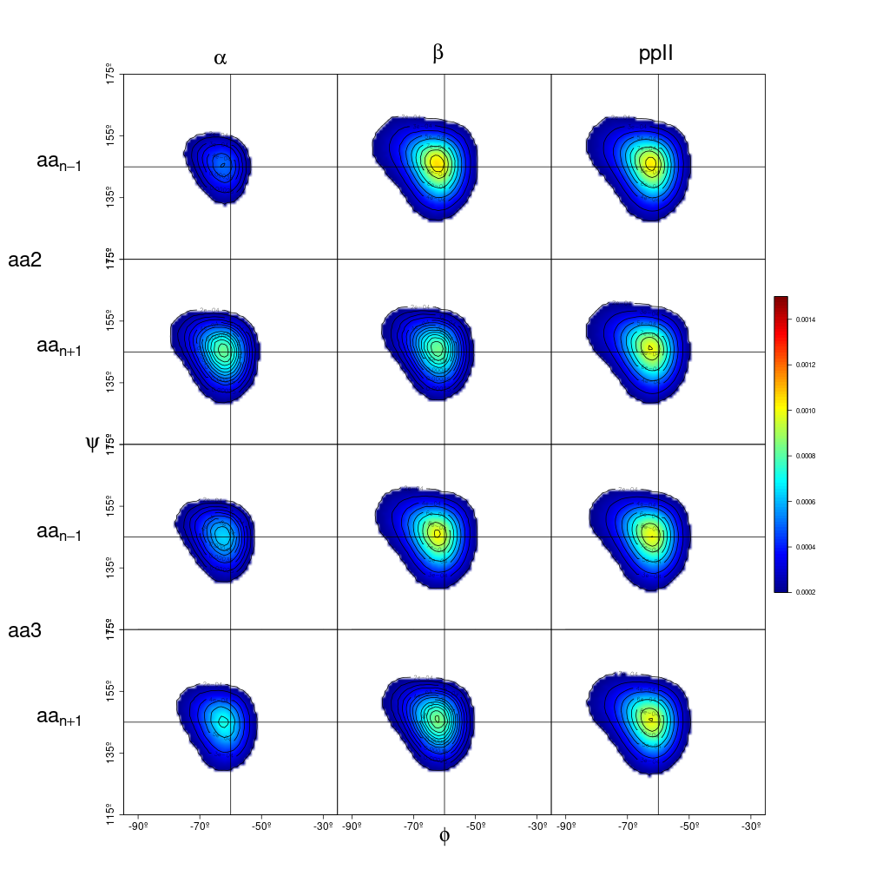

# NNR and global probabilities estimation and analysis in peptides or protein fragments
This module calculates global and NNR conformation dependent probabilites in each peptide residue.

First, workflow.sh bash script creates a workspace where results folder and dihedral angles .dat file  are generated.

After that, Python module obtains bidimensional arrays and probabilities about conformation population and structure combinations in global and NNR Conformation conditional methods.

Specifically, global_arrays.py and conditional_arrays.py generate the 2d arrays where dihedral angles value in each point is contained. Later, this arrays are used to calculate alpha, ppII, beta and remaining probabilities. In the first place, combinations probabilities are obtained by global_probabilities.py, directe_conditional_probabilities.py, inverse_conditional_probabilities.py. The programm it is called comparition.py joins this probabilities in a single file. On the other hand, population.py calculates global and conditional probabilites for each residue. This scripts create a csv file for each residue. 

Finally, R Markdown file (data_representation.Rmd) contains code chunks to represent graphically combination probabilites, population data and Ramachandran plots. In particular, this scripts export each graphic in a png file.

In this case, the data used for the example output files was from penta-alanine simulation.

## Ramachandran plot

## Conformation populations 

## Combination probabilities

