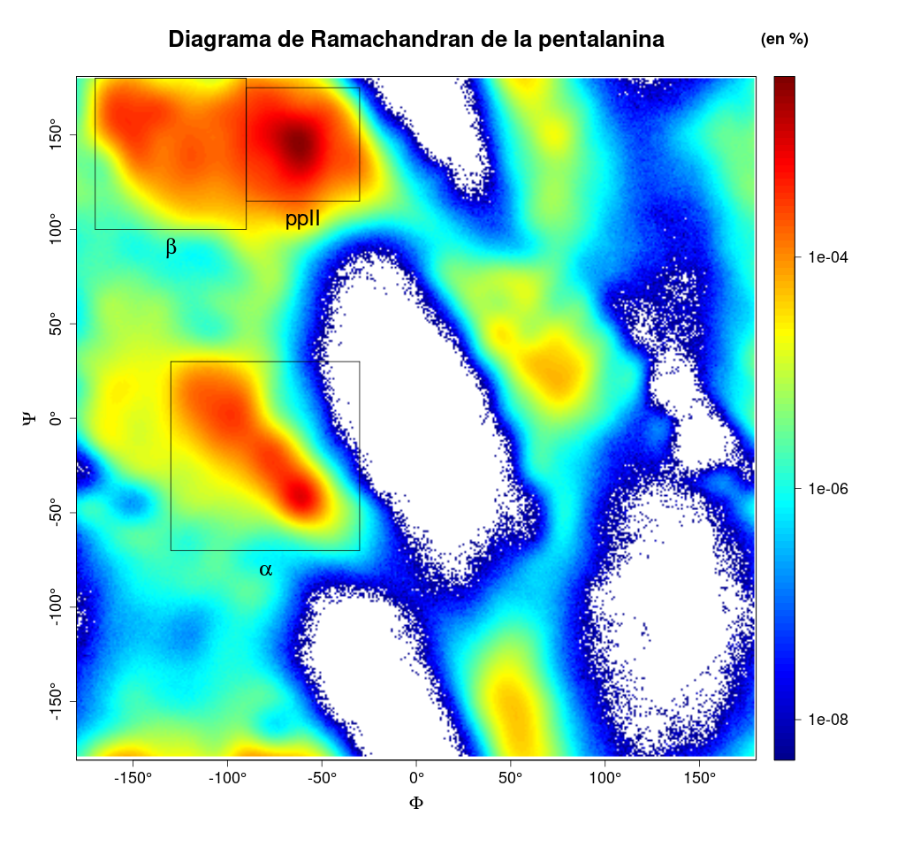

# NNR and global probabilities estimation and analysis in peptides or protein fragments
This module calculates global and NNR dependent probabilites in each peptide residue.

First, workflow.sh bash script creates a workspace where results folder and dihedral angles .dat file  are generated.

After that, Python module obtains bidimensional arrays and probabilities about conformation population and structure combination independt and NNR dependent methods.

Specifically, independent_arrays.py and conditional_arrays.py generate the 2d arrays where dihedral angles value in each point is contained. Later, this arrays are used to calculate alpha, ppII, beta and remaining probabilities. In the first place, combinations probabilities are obtained by independent_probabilities.py, directe_conditional_probabilities.py, inverse_conditional_probabilities.py. The programm called comparition.py joins this probabilities in a single file. On the other hand, population.py calculates indepent and conditional probabilites for each residue. This scripts create a csv file for each residue. 

Finally, R Markdown file (data_representation.Rmd) contains code chunks to represente graphically combination probabilites, population data and Ramachandran plot. Specifically, this scripts generate a png file for each data representation.

## Ramachandran plot

## Conformation populations 

## Combination probabilities

In this case, the data used for the example output files was from penta-alanine simulation.

